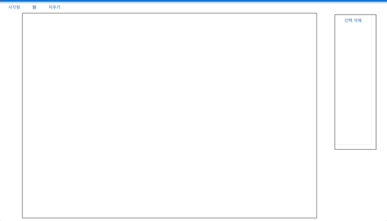
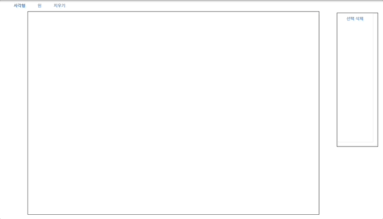
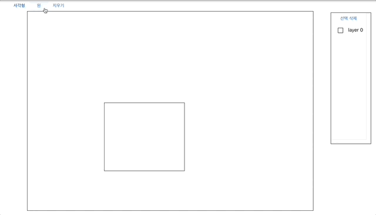

# 웹 그림판

## 프로젝트 설명
이 프로젝트는 웹 상에서 그림을 그릴 수 있는 웹 사이트입니다.

-  마우스를 드래그해서 사각형을 그릴 수 있습니다.
-  마우스를 드래그해서 원을 그릴 수 있습니다.
- 도형을 선택해서 삭제할 수 있습니다.
-  모든 도형을 일괄 삭제할 수 있습니다.
- 도형을 선택한 후 드래그로 위치를 바꿀 수 있습니다.
- 도형을 선택해서 표시 순서를 바꿀 수 있습니다. (e.g. 맨 앞으로 가져오기, 앞으로 가져오기, 맨 뒤로 보내기, 뒤로 보내기)
- 그려진 도형은 Client-side storage에 저장되어 페이지를 새로고침 해도 유지됩니다.

## 목차
- [설치](#설치)
- [사용법](#사용법)

## 설치
1. 프로젝트 클론 or 다운로드 후 해당 폴더에서 인스톨
- npm install

2. 설치 완료 후 실행
- npm start

## 사용법

일반 그림판과 같이 마우스 왼쪽 클릭으로 도형의 시작점을 설정, 드래그로 그릴 수 있습니다.

오른쪽의 선택박스를 통해 특정 도형을 선택 삭제 할 수 있습니다. 위의 메뉴바의 '지우기' 버튼 클릭 시 일괄 삭제가 가능합니다.

도형 드래그를 통해 위치를 변경할 수 있으며, 마우스 오른쪽 클릭으로 도형의 표시 순서를 변경이 가능합니다.

